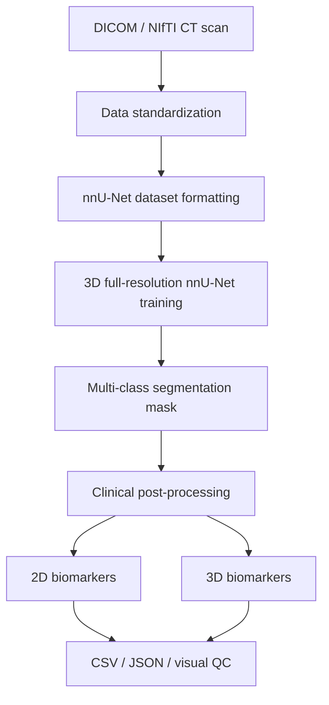

```mermaid
flowchart TD
    A[DICOM / NIfTI CT scan] --> B[Data standardization]
    B --> C[nnU-Net dataset formatting]
    C --> D[3D full-resolution nnU-Net training]
    D --> E[Multi-class segmentation mask]
    E --> F[Clinical post-processing]
    F --> G[2D biomarkers]
    F --> H[3D biomarkers]
    G --> I[CSV / JSON / visual QC]
    H --> I
```
